# 🌸 ComfyUI Flower Tools

這是一組專為 ComfyUI 設計的實用工具節點，專注於**提示詞管理 (Prompt Management)** 與 **檔案命名管理 (File Naming)**。原本是為了個人需求開發，現在整理開源給社群使用。

適合對象：
*   需要大量管理 Wildcards 或隨機提示詞的使用者。
*   需要自動化與標準化輸出檔名、路徑的使用者。
*   喜歡整潔、直觀操作介面的使用者。

## 📥 安裝說明 (Installation)

### 方法 1: 使用 ComfyUI Manager (推薦)
1.  開啟 **ComfyUI Manager**。
2.  搜尋 **Comfyui Flower Tools***。
2.  或點擊 **"Install via Git URL"**。
3.  輸入本專案網址: `https://github.com/weichenglin0215/comfyui-flower-tools`
4.  安裝完成後重啟 ComfyUI。

### 方法 2: 手動安裝(使用CMD視窗)
1.  進入您的 ComfyUI `custom_nodes` 目錄。
2.  執行 `git clone https://github.com/weichenglin0215/comfyui-flower-tools.git`
3.  重啟 ComfyUI。

---

## 🛠️ 節點介紹 (Nodes)

請參考工作流 位於 comfyui-flower-tools\workflows\Flower-Tools-Workflow.json

### 1. 🌸 Flower Multiline Prompt Selector (多行提示詞選擇器)

這是本工具包的核心節點，用於管理與選擇 Wildcards 檔案內容。它會自動讀取指定目錄下的 `.txt` 檔案，並產生直觀的按鈕介面。

**功能特色：**
*   **自動讀取**: 指定目錄路徑，自動列出所有 .txt 檔案。
    *   **支援絕對/相對路徑**: 可輸入空白（預設目錄）、絕對路徑（如 `C:\Prompt`）或相對路徑（如 `woman` 或 `..\other`）。
*   **三種模式**: 針對每個檔案，可獨立設定：
    *   🎲 **Random**: 隨機選取一行。
    *   🔢 **Ordered**: 依序選取每一行 (搭配 Seed)。
    *   ✅ **Picked**: 手動指定固定使用某一行。
*   **兩種輸出模式 (Output Mode)**:
    *   **循序模式 (Sequential)**: 將所有啟用的檔案內容合併後，依序輸出一行（傳統模式）。
    *   **組合模式 (Combination)**: 每個啟用的檔案各自輸出一行，並組合為一個長句子。
*   **視覺化介面**: 每個檔案都有獨立按鈕，點擊即可開啟詳細設定視窗。
*   **連續處理 (Continuous Processing)**: 可設定 "每 N 張圖換一次提示詞"，適合生成同一個提示詞的多張變體 (Variations)。
*   **自然排序**: 檔案清單支援自然的數字與中文排序，保證 UI 顯示與執行順序一致。

*   **兩種輸出模式 (Output Mode)**:
    *   **循序模式 (Sequential)**: 將所有啟用的檔案內容合併後，依序輸出一行（傳統模式）。
	通常用在產出多張預先寫好的分類提示詞，自己構思或在網路上學習的提示詞，分門別類記錄在不同文字檔案中。
	例如在wildcards目錄下的幾個範本文字檔"咒語列表_普級_日式少女寫真.txt"、"咒語列表_普級_可愛清新.txt"
	透過這個節點可以連續產出相關圖檔。
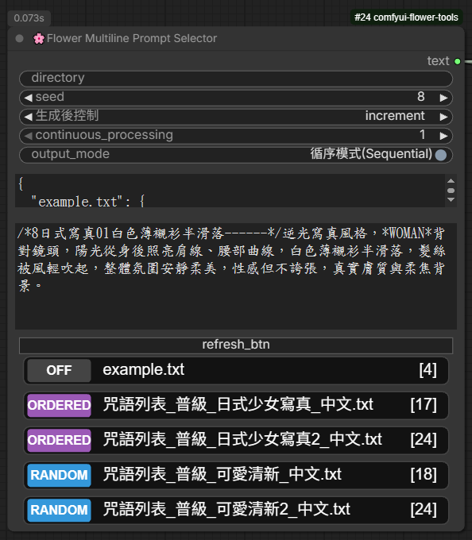

    *   **組合模式 (Combination)**: 每個啟用的檔案各自輸出一行，並組合為一個長句子。
	通常用於多變化的組合，例如每張圖片使用不同國籍的女性、年紀、表情與體型。
	搭配🌸 Flower Keyword Replacer (關鍵字替換器)，可以輸出多變化的提示詞。
	請參考"wildcards\女人"目錄下的多個提示詞文檔。
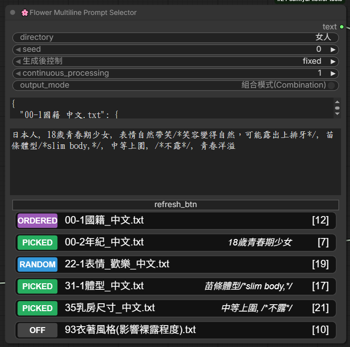

---

### 2. 🌸 Flower Keyword Replacer (關鍵字替換器)

簡單直覺的文字替換工具，適合用來微調提示詞或批量測試不同概念。

**功能特色：**
*   **10 組替換槽**: 支援最多 10 組 `Keyword` (關鍵字) -> `Replacement` (替換內容) 的設定。
*   **動態輸入**: 可將任何字串節點連接到輸入端。

**使用情境：**
*   簡化提示詞寫法，搭配 Flower Mulitline Prompt Selector可以衍伸多變化內容。
原提示詞："*WOMAN*，穿著*Color*短版襯衫。"。
輸出提示詞："一位青春洋溢的18歲少女，表情自然帶笑，穿著駝色短版襯衫。"
*   將提示詞模板中的 `keyword` 替換成 `replacement`。
*   將 `*WOMAN*` 替換成 `一位青春洋溢的18歲少女，表情自然帶笑`。
*   將 `*Color*` 替換成 `駝色`。

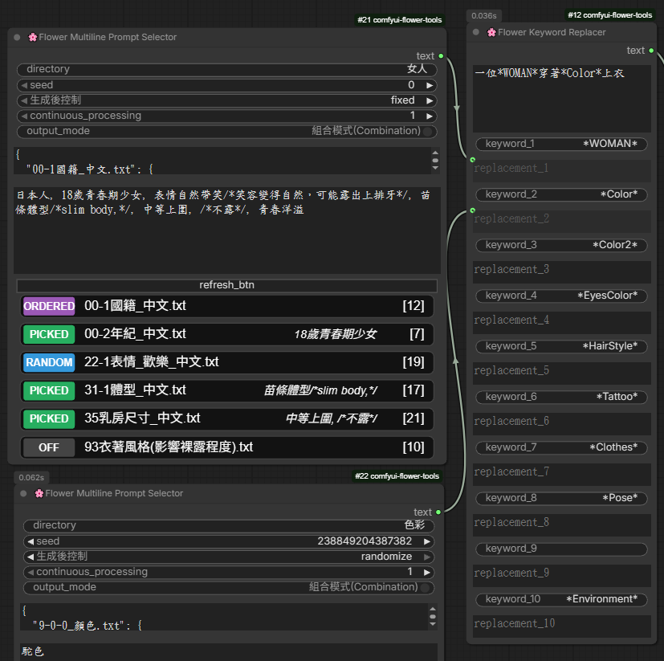

---

### 3. 🌸 Flower List of Strings (字串清單組合器)

將多個字串合併為一個長字串或列表，適合組合多個提示詞來源。

**功能特色：**
*   **10 個輸入槽**: 支援 10 個多行文字輸入。
*   **自訂分隔符 (Delimiter)**: 可設定連接字串時的中間符號 (如 `,` 或 `\n`)。
*   **雙輸出**: 同時輸出 "合併後的單一字串" 與 "字串列表 (List)"。

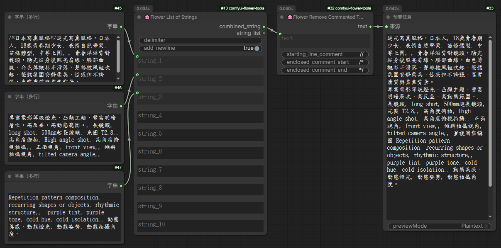

---

### 4. 🌸 Flower File Name Combination (路徑檔名組合生成器)

專為喜好簡約設計感的使用者製作的路徑與檔名生成器。解決 ComfyUI 預設檔名過於簡單或混亂的問題。

**功能特色：**
*   **變數系統**: 支援使用 `%DATE%`, `%TIME%` 等變數自動產生日期時間。
*   **路徑/檔名同步**: 勾選 `File name same as subfolder name` 可讓檔名自動跟隨資料夾名稱，省去重複輸入的麻煩。
*   **非法字元防護**: 自動過濾 Windows/Linux 檔名不允許的符號 (如 `*`, `?`, `|`)，避免存檔失敗。
*   **筆記功能 (Note)**: 底部附帶筆記欄位，方便紀錄常用的格式參數。

**支援變數：**
*   `%MainFolderName`: 主目錄
*   `%SubFolderName`: 子目錄
*   `%FileName`: 檔名
*   `%Suffix`: 後綴 (如版本號)
*   `%DATE`: 日期 (如 2024-02-10)
*   `%TIME`: 時間 (如 12-30-59)

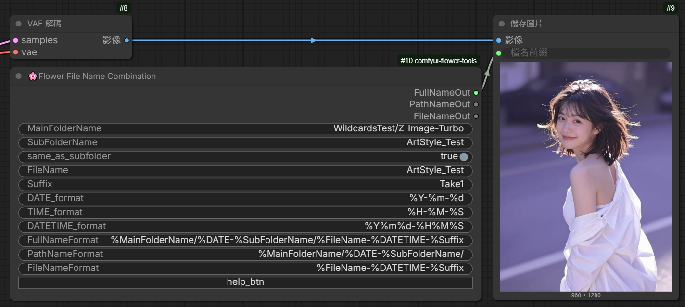

---

### 5. 🌸 Flower TCSC Converter (繁簡中文轉換器)

專為中文使用者設計的繁簡體轉換工具，支援台灣慣用語彙的轉換 (OpenCC)。

**功能特色：**
*   **雙向轉換**: 支援「繁體 (台灣) -> 簡體」與「簡體 -> 繁體 (台灣)」。
*   **OpenCC 核心**: 使用高品質的 OpenCC 字典，非僅僅字對字轉換，包含詞彙轉換 (如: 滑鼠 <-> 鼠标)。
*   **自動安裝**: 內建一鍵安裝 OpenCC 依賴庫功能，自動偵測並修復環境問題 (支援 Windows/Linux)。
*   **唯讀預覽**: 轉換結果顯示於唯讀文字框，方便直接複製或檢視。

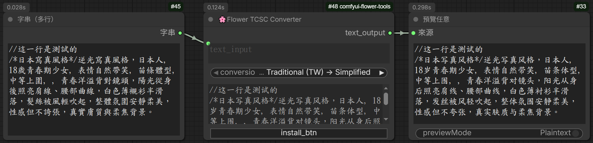

**安裝說明：**
* 未安裝或執行錯誤時，請點擊"install_btn"按鍵，會自動安裝OpenCC在**ComfyUI_windows_portable_Audio\python_embeded\Lib\site-packages\opencc**
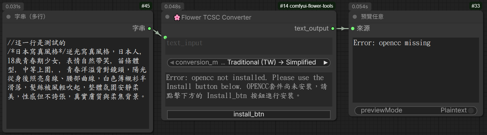

* 安裝前會跳出提示視窗，請點擊"確定"


* 指令視窗中會顯示安裝過程
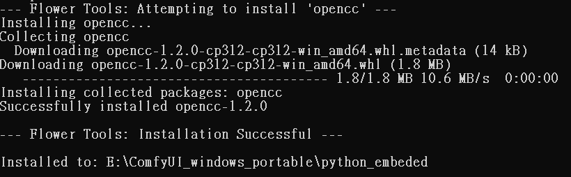

* 安裝成功
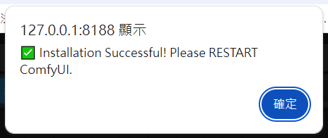

---

### 6. 🌸 Flower String Comparison (字串比對)

比對B字串是否包含在A字串之中，並輸出位置。(此節點優處是可輸出位置與是否有找到。)

**功能特色：**
*   **大視窗顯示**: 優化了 UI 排版，提供兩個大型文字框方便放入長內容。
*   **多重比對方式**: 從前面或後面開始比對、比對次數與區分大小寫。。

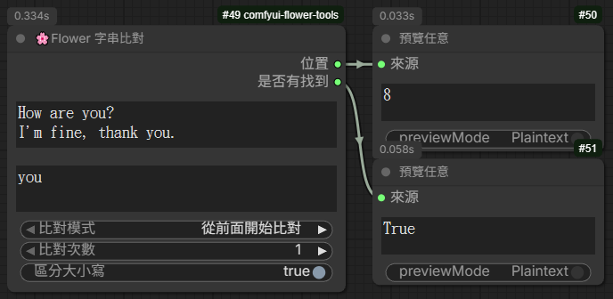

---

### 7. 🌸 Flower Remove Commented Text (註解過濾器)

自動偵測並移除文字中的註解（如 `//` 或 `/* ... */` 或 '<...>'），讓您可以直接在 Prompt 檔案中撰寫筆記。

**功能特色：**
*   **單行註解**: 支援過濾預設為 `//` 開頭的行內註解。
*   **區塊註解**: 支援過濾預設由 `/*` 開頭並由 `*/` 結尾的區塊註解。
*   **自定義符號**: 可自行修改註解的開始與結束符號，相容性高。

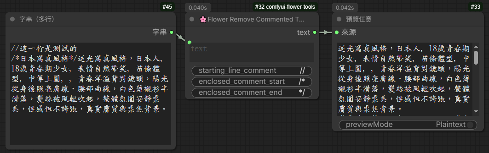

---

## 📂 目錄結構 (Directory Structure)

您的 Wildcards (提示詞檔案) 預設應放在本插件目錄下的 `wildcards` 資料夾中：

```
ComfyUI/
  └── custom_nodes/
      └── comfyui-flower-tools/
          └── wildcards/
              ├── example.txt
              ├── 咒語列表_普級_日式少女寫真_中文.txt
              ├── 咒語列表_普級_日式少女寫真2_中文.txt
              └── 色彩
				  ├── 9-0-0_顏色.txt
                  └── 9-1-0_低彩度傳統色_中文.txt
```

您也可以在 Prompt Selector 節點的 `directory` 欄位輸入絕對路徑來讀取其他位置的檔案。

## 📜 更新日誌 (Changelog)

*   **2026-02-24**: 
    *   新增 `FlowerRemoveCommentedText` 節點。
    *   `FlowerMultilinePromptSelector` 重大更新：新增「組合模式 (Combination)」、支援絕對/相對目錄輸入、修正中文排序邏輯一致性、修復 F5 重新整理後內容消失的問題。
*   **2026-02-13**: 新增 `FlowerStringComparison` 節點。
*   **2026-02-10**: 新增 `FlowerFileNameCombination` 與 `FlowerListOfStrings` 節點。介面全面中文化與優化。
*   **2026-02-02**: 名稱變更為 `Flower Multiline Prompt Selector`，優化排序邏輯。

---

*Made with ❤️ by weichenglin0215*
